# LARIMÍA System Architecture

## 1. Platform Topology

```mermaid
flowchart TB
    subgraph Clients
        CW[Customer Web]
        CM[Customer Mobile]
        PM[Pro Mobile]
        OW[Ops Web]
    end

    subgraph Edge
        CDN[CDN / WAF]
        GW[API Gateway]
        AUTH[OIDC Identity]
    end

    subgraph Core
        API[FastAPI Core]
        WORKER[Celery Workers]
        SCHED[Scheduler]
    end

    subgraph Data
        PG[(PostgreSQL + PostGIS)]
        REDIS[(Redis)]
        OBJ[(Object Storage)]
        MQ[RabbitMQ]
    end

    subgraph External
        PAY[Payments]
        MAPS[Maps / Routing]
        SMS[SMS]
        MAIL[Email]
        PUSH[Push]
        IDV[Identity Verification]
        BGC[Background Checks]
    end

    CW --> CDN
    CM --> CDN
    PM --> CDN
    OW --> CDN
    CDN --> GW
    GW <--> AUTH
    GW --> API

    API --> PG
    API --> REDIS
    API --> OBJ
    API --> MQ

    MQ --> WORKER
    SCHED --> MQ

    API --> PAY
    API --> MAPS
    WORKER --> SMS
    WORKER --> MAIL
    WORKER --> PUSH
    WORKER --> IDV
    WORKER --> BGC
```



## 2. Architecture Principles

1. PostgreSQL is business truth.
2. Redis is never authoritative for booking or money.
3. External systems are accessed through adapters.
4. Commands express business intent.
5. Domain modules own their data.
6. Outbox events are committed with business transactions.
7. Search, notifications, analytics, and CRM may be eventually consistent.
8. Booking ownership, availability, payments, and ledger may not.
9. Privileged changes are auditable.
10. Microservice extraction requires evidence.

## 3. Frontend Repository

```text
larimia-frontend/
├── apps/
│   ├── customer/
│   ├── pro/
│   └── ops/
├── packages/
│   ├── api-sdk/
│   ├── auth/
│   ├── design-system/
│   ├── domain-types/
│   ├── localization/
│   ├── maps/
│   ├── money/
│   ├── telemetry/
│   ├── validation/
│   └── testing/
├── e2e/
├── tooling/
├── pnpm-workspace.yaml
└── turbo.json
```

## 4. Backend Repository

```text
larimia-backend/
├── apps/
│   ├── api/
│   ├── worker/
│   └── scheduler/
├── src/larimia/
│   ├── identity/
│   ├── customers/
│   ├── providers/
│   ├── catalog/
│   ├── availability/
│   ├── pricing/
│   ├── quotes/
│   ├── bookings/
│   ├── dispatch/
│   ├── visits/
│   ├── communications/
│   ├── payments/
│   ├── ledger/
│   ├── payouts/
│   ├── memberships/
│   ├── promotions/
│   ├── partners/
│   ├── reviews/
│   ├── quality/
│   ├── safety/
│   ├── support/
│   ├── inventory/
│   ├── compliance/
│   ├── notifications/
│   ├── analytics/
│   ├── markets/
│   └── shared/
├── adapters/
├── migrations/
├── contracts/
├── tests/
└── deploy/
```

## 5. Internal Module Template

```text
bookings/
├── domain/
│   ├── entities.py
│   ├── enums.py
│   ├── events.py
│   ├── policies.py
│   └── errors.py
├── application/
│   ├── commands/
│   ├── queries/
│   ├── services.py
│   └── ports.py
├── infrastructure/
│   ├── models.py
│   ├── repositories.py
│   └── mappings.py
└── api/
    ├── routes.py
    └── schemas.py
```

## 6. Extraction Path

Likely future service extraction order:

1. notifications
2. analytics/event ingestion
3. dispatch/matching
4. communications
5. document/verification processing

Keep bookings, payments, and ledger together until proven scale or ownership requires otherwise.
