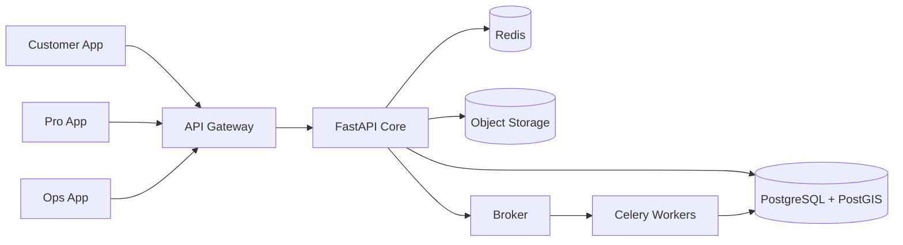
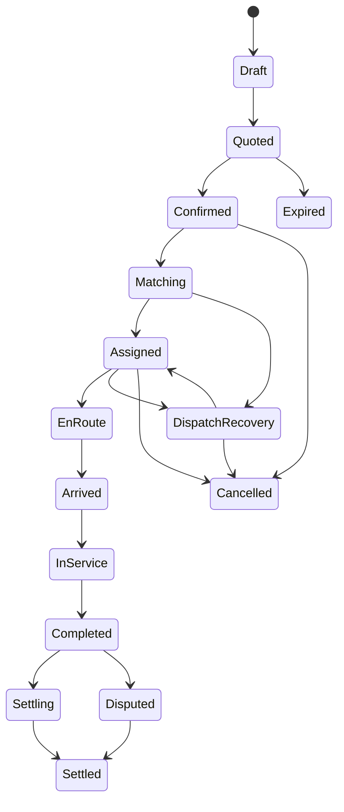

# SPEC-001-LARIMÍA Marketplace Platform

## Background

LARIMÍA is a bilingual, Dominican-first marketplace that sends verified beauty, grooming, wellness, massage, and fitness professionals to homes, hotels, villas, offices, and events.

The platform must operate like a real-time service marketplace rather than a salon scheduling app. It coordinates demand, provider eligibility, travel time, availability, equipment, safety, payment, quality, and operational recovery.

### Brand

- **Name:** LARIMÍA
- **Meaning:** *larimar* + *mía*
- **Spanish promise:** *Tu bienestar llega a ti.*
- **English promise:** *Wellness, delivered personally.*

## Requirements

### Must

- Customer, Provider, and Operations applications
- Spanish and English
- DOP and USD support
- Home, hotel, villa, office, and event locations
- Massage, haircut/barbering, styling, makeup, grooming, and personal training
- Provider identity, credentials, skills, insurance, and kit verification
- Geographic service zones
- Travel-time-aware availability
- ASAP and scheduled bookings
- Immutable confirmed quote snapshot
- Payment authorization, capture, refund, and dispute handling
- Provider assignment with database-level race protection
- Database-level provider double-booking prevention
- En-route, arrival, PIN start, completion lifecycle
- Push/SMS/email notifications
- Masked provider/customer communications
- Safety incident and SOS workflow
- Reviews and provider quality controls
- Provider earnings and payouts
- Double-entry accounting
- Operations dispatch board
- Hotel/corporate booking workflow
- Role-based and record-level authorization
- MFA for providers and staff
- Audit log for privileged actions
- Production observability, backup, restore, and disaster recovery
- Market-specific configuration for Dominican Republic and United States

### Should

- Memberships and service credits
- Favorite/rebook provider
- Automated late-risk recovery
- Promotions and referrals
- Tips
- Provider training
- Inventory/kit tracking
- Hotel contracted pricing
- Daily payment reconciliation
- Feature flags by city and service

### Could

- Group bookings
- Multiple providers per booking
- Gift cards
- AI-assisted support
- AI-assisted dispatcher recommendations
- Demand-based pricing
- Provider route optimization

### Won't in MVP

- Large microservice estate
- Proprietary navigation
- Custom payment processing
- Raw card storage
- Medical diagnosis or treatment
- Fully autonomous AI dispatch

## Method

### 1. System Boundaries



### 2. Applications

#### LARIMÍA Customer
- Service discovery
- Quote
- Availability
- Checkout
- Live booking status
- Messaging
- Safety
- Tips
- Reviews
- Rebooking
- Membership

#### LARIMÍA Pro
- Onboarding
- Credentials
- Availability
- Offers
- Assignment acceptance
- Navigation
- Arrival
- PIN-based service start
- Completion
- Safety
- Earnings
- Payouts
- Education

#### LARIMÍA Ops
- Live dispatch
- Booking intervention
- Customer support
- Safety incidents
- Provider verification
- Quality management
- Catalog and pricing
- Promotions
- Memberships
- Hotels/corporate
- Finance
- Refunds
- Payouts
- Reconciliation
- Compliance
- Audit

### 3. Backend Domains

```text
identity
customers
providers
catalog
availability
pricing
quotes
bookings
dispatch
visits
communications
payments
ledger
payouts
memberships
promotions
partners
reviews
quality
safety
support
inventory
compliance
notifications
analytics
markets
shared
```

Each module owns:
- domain entities,
- commands,
- policies,
- database tables,
- repository interfaces,
- events,
- tests.

A module may not write another module's tables directly.

### 4. Booking Lifecycle



### 5. Booking Invariants

1. Confirmed bookings preserve an immutable commercial snapshot.
2. Confirmation requires payment authorization or approved partner credit.
3. A provider cannot hold overlapping active assignments.
4. Service cannot start without authorized arrival verification except audited Ops override.
5. Every command requires idempotency.
6. Every concurrent aggregate uses optimistic versioning.
7. Every booking transition creates audit and outbox events in the same transaction.
8. Corrections use compensating actions; historical records are not rewritten.
9. Provider payout eligibility begins only after capture and completion.
10. External webhooks are authenticated, deduplicated, persisted, and replay-safe.

### 6. Matching

Eligibility first, ranking second.

#### Hard Gates

- Provider active
- Identity verified
- Approved for service
- Credentials valid through appointment end
- Kit/equipment ready
- Service zone matches
- Travel time acceptable
- No schedule overlap
- Market rules satisfied
- No active safety/compliance restriction

#### Ranking

```text
score =
  0.30 arrival_reliability
+ 0.20 service_quality
+ 0.15 punctuality
+ 0.15 customer_affinity
+ 0.10 fairness
+ 0.10 equipment_fit
```

Protected characteristics and socioeconomic proxies must never be ranking inputs.

### 7. Dispatch

Suggested launch waves:

```text
Wave 1: top 3 candidates, 45s
Wave 2: next 5 candidates, 60s
Wave 3: expanded configured radius, 60s
Wave 4: human dispatcher
```

Provider acceptance is atomic:

```text
BEGIN
lock booking
verify booking is MATCHING
verify offer active
verify provider still available
verify booking version
create assignment
reserve provider interval
mark booking ASSIGNED
expire competing offers
insert audit event
insert outbox event
COMMIT
```

Only one candidate can win.

### 8. Pricing

```text
base service
+ add-ons
+ zone/travel
+ time-window adjustment
+ equipment/venue surcharge
+ demand adjustment
- promotion
- membership benefit
= taxable subtotal
+ tax
+ optional tip
= customer total
```

Money is stored in integer minor units and always paired with ISO currency code.

### 9. Payment Lifecycle

1. Processor tokenizes payment method.
2. LARIMÍA receives token only.
3. Payment authorized at confirmation.
4. Service completed.
5. Charge captured.
6. Ledger transaction posted.
7. Provider earning becomes eligible according to reserve/dispute policy.
8. Payout created only after reconciliation.

### 10. Double-Entry Ledger

All financial movements use balanced entries.

Example:

```text
Customer receivable   DR 10000
Provider payable      CR 6500
Platform revenue      CR 2500
Tax payable           CR 1000
```

Amounts shown in minor units for illustration.

### 11. Safety

Before activation:
- ID/liveness
- applicable background check
- credentials
- insurance when required
- skill assessment
- code of conduct
- safety/boundaries training
- kit/sanitation inspection

During visit:
- masked communication
- limited-purpose location
- geofence arrival
- customer PIN
- SOS
- no unapproved provider substitution

After visit:
- two-sided completion
- private safety feedback
- incident case management
- evidence retention policy
- account restriction workflow

### 12. Country Policy Layer

All country and city variation is configuration-backed.

Examples:

```text
DO-SDQ
DO-PUJ
DO-STI
US-MIA
US-NYC
```

Policies control:
- currency
- taxes
- provider requirements
- cancellation
- payment providers
- background checks
- insurance
- service hours
- travel radius
- local pricing

## Implementation

See [IMPLEMENTATION.md](IMPLEMENTATION.md).

## Milestones

### M0 — Legal and Architecture Authority
- brand/trademark clearance
- worker model
- insurance
- privacy and safety policies
- ADR approval
- threat model

### M1 — Platform Foundation
- repositories
- CI/CD
- identity
- roles
- market configuration
- observability
- PostgreSQL/PostGIS
- Redis
- broker
- object storage

### M2 — Marketplace Core
- providers
- catalog
- availability
- quotes
- booking state machine
- payment authorization/capture
- ledger

### M3 — Dispatch Pilot
- provider offers
- atomic assignment
- travel estimates
- Pro app
- Ops dispatch
- PIN start
- notifications

### M4 — Controlled Santo Domingo Launch
- customer web/mobile
- safety desk
- reviews
- refunds
- support
- reconciliation
- provider payout

### M5 — Operational Scale
- automated ranking
- late-risk recovery
- memberships
- hub inventory
- hotel/corporate workflow
- quality scorecards

### M6 — Multi-Market Expansion
- Punta Cana/Bávaro
- Santiago
- U.S. adapter validation
- U.S. metro pilot

## Gathering Results

Primary launch scorecard:

- quote-to-book conversion
- time to assignment
- offer acceptance
- on-time arrival
- completed booking rate
- recovery success
- customer repeat rate
- same-provider rebook rate
- service-specific rating
- safety incident rate
- incident acknowledgement time
- provider utilization
- provider earnings/hour
- contribution margin per booking
- refund/chargeback rate
- reconciliation breaks
- payout timeliness
- booking API availability
- dispatch availability
- worker lag
- restore test success

North-star metric:

> **Successfully completed, safely delivered service hours with a customer willing to rebook.**

## Need Professional Help in Developing Your Architecture?

Please contact me at [sammuti.com](https://sammuti.com) :)
