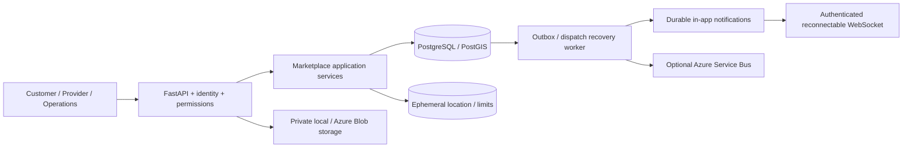

# Architecture

The original repository exposed success-shaped placeholders for payment, dispatch and onboarding;
booking writes lacked ownership and durable replay. Those handlers remain unmounted historical source.
`larimia.main` mounts persisted marketplace routes at `/api/v1` and compatible aliases at `/v1`.

`marketplace/domain.py` owns legal booking transitions, exact minor-unit pricing, scoring and journal
balance checks. `service.py` owns transactional lifecycle coordination; `commands.py` owns idempotent
command transactions. `models.py` persists aggregates. `operations.py` handles secondary operational
workflows; its application coordination should be extracted further as these workflows grow.

Synchronous SQLAlchemy/psycopg request services are intentionally retained from the repository and run
in FastAPI's thread pool. The original async-driver target is not claimed as implemented. Network event
publication uses persisted leases and occurs outside transaction scope. Current payment adapter is local
and deterministic; a real gateway requires a durable payment-attempt/reconciliation extension before it
can replace that adapter. See ADR 001.

Legacy `bookings` rows are retained unchanged. New quotes cannot safely be invented for client-priced
legacy rows, so new transactions use `marketplace_bookings`; operations can inspect legacy records at
`/admin/legacy/bookings`. Existing data needs reviewed customer/quote mapping before cutover. This is an
explicit compatibility limitation, not a claim that legacy records were migrated.
